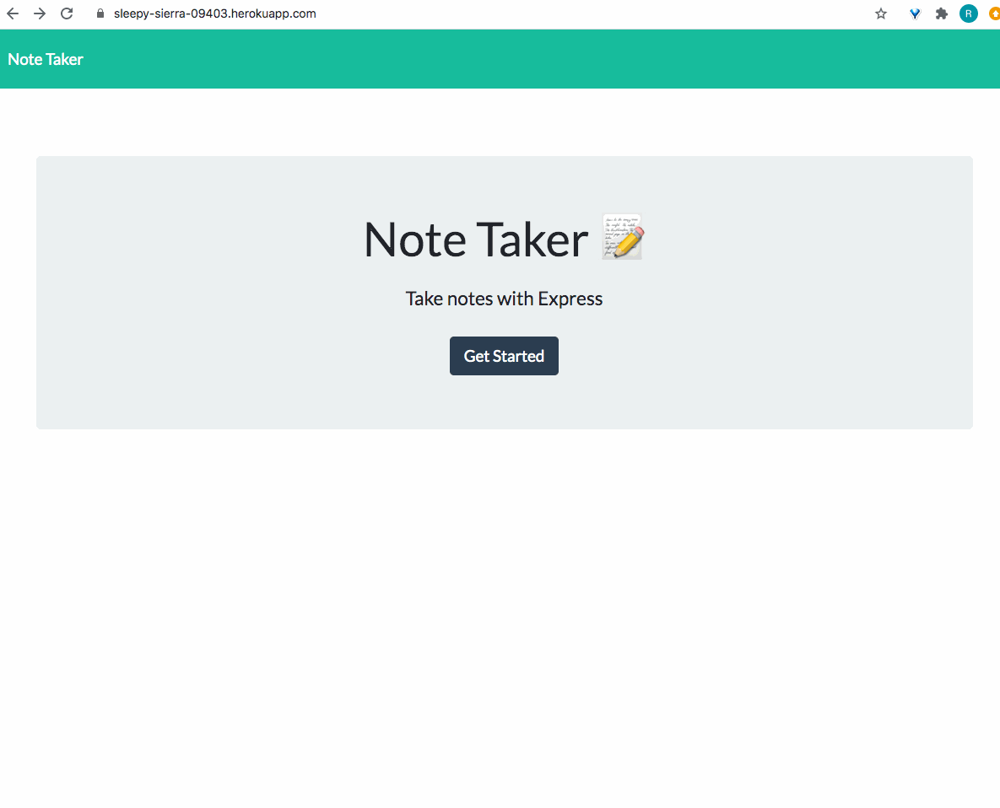

# Note Taker
  
  
## Table of Contents

* [Description](#description)
* [Installation](#installation)
* [Usage](#usage)
* [License](#license)
* [Contributing](#contributing)
* [Tests](#tests)
* [Questions](#questions)
  
## Description
This application can be used to write, save, and delete notes.

## Installation 
No installation is required.  To use the application load `https://sleepy-sierra-09403.herokuapp.com/notes` into the browser.

## Usage
From the homepage click the button "Get Started" and you are directed to the note-taking page.  From here you can click on the "Note Title" text box and type the title of your note.  The user can then tab to the "Note Text" part of the body, or click on the placeholder text to begin entering the text of their note.  When finished writing out the note click the save icon in the top right corner and the note is saved in the column to the left with the title of the note displayed.  If the user closes the webpage and returns later the note will persist until the user clicks on the red trash can icon to delete it.  To write a new note the user can follow the same instructions for the first note, or click on the pencil icon in the top right corner.  Clicking on the "Note Taker" text in the top left corner will return the user to the homepage.  

## License
Copyright (c) 2020 robkellen
  
MIT License
    
Permission is hereby granted, free of charge, to any person obtaining a copy of this software and associated documentation files (the "Software"), to deal in the Software without restriction, including without limitation the rights to use, copy, modify, merge, publish, distribute, sublicense, and/or sell copies of the Software, and to permit persons to whom the Software is furnished to do so, subject to the following conditions:
    
The above copyright notice and this permission notice shall be included in all copies or substantial portions of the Software.
    
THE SOFTWARE IS PROVIDED "AS IS", WITHOUT WARRANTY OF ANY KIND, EXPRESS OR IMPLIED, INCLUDING BUT NOT LIMITED TO THE WARRANTIES OF MERCHANTABILITY, FITNESS FOR A PARTICULAR PURPOSE AND NONINFRINGEMENT. IN NO EVENT SHALL THE AUTHORS OR COPYRIGHT HOLDERS BE LIABLE FOR ANY CLAIM, DAMAGES OR OTHER LIABILITY, WHETHER IN AN ACTION OF CONTRACT, TORT OR OTHERWISE, ARISING FROM, OUT OF OR IN CONNECTION WITH THE SOFTWARE OR THE USE OR OTHER DEALINGS IN THE SOFTWARE.

## Contributing
To contribute to this project please email me at rob.h.kellen@gmail.com.

## Tests
To test the application please visit the webpage and create/delete your own notes.  
  
## Questions
Please email me at rob.h.kellen@gmail.com with any questions about this project.  You can also see more of my work by visiting my GitHub profile at [robkellen](https://github.com/robkellen).

